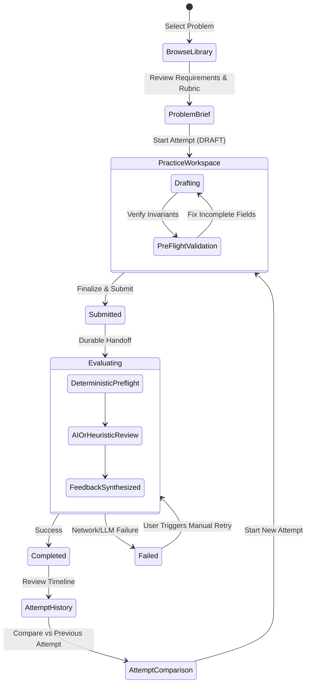

# Design Note — Architect Workbench (LLD Practice Platform)

## 1. MVP Definition

The Architect Workbench is an interactive evaluation and practice environment for Low-Level Design (LLD). It addresses the core failure mode of modern system design preparation: passive consumption of video solutions without deliberate practice or actionable feedback.

The MVP focuses on the complete, single-player engineering loop:
1. **Explore Problems**: Browse curated, realistic object-oriented design problems with clear requirements, constraints, and rubric criteria.
2. **Author Design Sheets**: Fill structured design sheets covering functional understanding, assumptions, class definitions, responsibilities, relationships, trade-offs, and edge cases.
3. **Pre-flight & Submit**: Validate structural integrity deterministically before committing to evaluation.
4. **Evidence-Based Evaluation**: Receive rubric-dimensional feedback with concrete citations, concerns, actionable suggestions, and confidence scores.
5. **Iterate & Compare**: Save multiple attempts, track progression over time, and compare attempts side-by-side with semantic diffs.

---

## 2. Core User Flow



1. **Discovery**: The learner selects a problem (e.g., *Parking Lot System*) from the Library or Dashboard.
2. **Drafting**: In the 3-column workspace, the learner drafts assumptions, class structures (methods, attributes), relationships, trade-offs, and edge cases, observing live telemetry (completeness meters, relationship graph stats).
3. **Pre-flight**: Clicking *Run Pre-Flight Inspection* flags empty responsibilities, orphaned relationships, or missing edge cases without consuming evaluation quota.
4. **Submission & Evaluation**: Clicking *Submit Design* locks the attempt (`SUBMITTED`), commits it to durable storage, and transitions to `EVALUATING`. The evaluation engine processes the attempt and persists evidence-backed feedback (`COMPLETED`).
5. **Review & Compare**: The learner inspects explainable feedback cards and compares their current design against prior attempts to measure improvement.

---

## 3. Submission Model & Rationale

### The Decision: Structured Text Design Sheet
We considered three submission formats:
1. **Full Executable Code (Java/TypeScript)**: Requires a sandboxed execution runtime, language-specific compilers, and rigid test harness assertions. Rejects valid design variations (e.g., interface vs abstract class) that satisfy all requirements.
2. **Unstructured Freeform Markdown**: Highly expressive, but suffers from severe LLM hallucination, parser ambiguity, and unreliable evaluation metrics.
3. **Structured Text Design Sheet (Chosen)**:
   - `requirementsUnderstanding`: Functional breakdown & invariants
   - `assumptions`: Explicit scope boundaries
   - `classes`: Array of `{ name, type, responsibilities, attributes, methods }`
   - `relationships`: Array of `{ source, target, type, multiplicity }`
   - `designDecisions`: Array of `{ decision, rationale, alternativeRejected }`
   - `edgeCases`: Array of `{ scenario, handlingStrategy }`

### Why This Format Was Chosen:
- **Direct Domain Mapping**: Maps 1:1 to how senior engineers communicate during technical design reviews (RFCs).
- **Deterministic Validation**: Allows fast, client-side and server-side graph checks (e.g., verifying that relationship endpoints exist in the declared classes, method signatures are non-empty).
- **Prompt Reliability**: Gives LLMs consistent, typed structural anchors, virtually eliminating hallucinations and token waste.
- **Language Agnostic**: Focuses on object-oriented fundamentals (coupling, cohesion, SOLID, polymorphism) rather than syntax quirks.

---

## 4. Key Domain Classes & Interfaces

The system strictly follows Clean Architecture / Hexagonal Architecture:

```
src/
├── domain/                    # Pure TypeScript business rules & invariants
│   ├── problem/               # Problem aggregate, constraints, starter templates
│   ├── attempt/               # Attempt aggregate, status state machine
│   ├── submission/            # Submission value object, structural validation
│   ├── evaluation/            # Evaluation aggregate, FeedbackItem, RubricScore
│   ├── rubric/                # Rubric entities & 8 default evaluation dimensions
│   └── evaluator/             # Evaluator interface (Port)
├── application/               # Use cases orchestrating domain & ports
│   ├── CreateAttemptUseCase
│   ├── SubmitAttemptUseCase
│   ├── EvaluateAttemptUseCase
│   ├── CompareAttemptsUseCase
│   └── ...
├── infrastructure/            # Adapters (Database, LLMs, Deterministic rules)
│   ├── db/                    # Prisma repositories (SQLite/PostgreSQL)
│   └── evaluator/             # DeterministicEvaluator, HeuristicEvaluator, AIEvaluator, CompositeEvaluator
└── app/                       # Next.js Presentation & API Routes
```

### Core Entities & Invariants:
- `Attempt`: Encapsulates attempt lifecycle. Invariant: `saveDraft()` can only be called in `DRAFT` status; `submit()` transitions `DRAFT → SUBMITTED`.
- `Submission`: Value object holding the design sheet. Invariant: Enforces unique class names, non-empty responsibilities, and valid relationship endpoint references.
- `Evaluation`: Holds rubric-level feedback items and overall assessment.
- `Evaluator (Port)`:
  ```typescript
  export interface Evaluator {
    evaluate(problem: Problem, submission: Submission): Promise<EvaluationResult>;
  }
  ```

---

## 5. State Machine & Lifecycle Invariants

The platform enforces a strict, monotonic lifecycle:

```
[DRAFT] ────── submit() ──────> [SUBMITTED] ────── startEvaluation() ──────> [EVALUATING]
   │                                                                               │
   │                                                         ┌─────────────────────┴─────────────────────┐
   │                                                         ▼                                           ▼
   └──────── (persisted draft autosaves)               [COMPLETED]                                    [FAILED]
                                                             │                                           │
                                                             ▼                                           ▼
                                                    (Feedback Viewable)                         (Retry Permitted)
                                                                                                         │
                                                                                                         └──── retry() ──> [EVALUATING]
```

### Invariants:
1. **Persist Before Evaluate**: A submission is *always* committed to the database with status `SUBMITTED` *before* the evaluation engine is invoked. If the evaluator crashes or the browser disconnects, the user's work is never lost.
2. **Immutable Submission**: Once an attempt transitions to `SUBMITTED`, the design sheet content is immutable. Further revisions require creating a new attempt.
3. **No Silent State Skipping**: `DRAFT` cannot jump directly to `COMPLETED`. Every transition is explicitly recorded with audit timestamps (`submittedAt`, `evaluatedAt`).

---

## 6. Evaluation Approach: Deterministic vs. AI Split

Rather than relying purely on an LLM (which introduces latency, hallucinations, and non-determinism) or purely on regex heuristics (which fail at semantic comprehension), we employ a **hybrid composite pipeline**:

```mermaid
graph TD
    Sub[Submission Received] --> Det[Deterministic Evaluator]
    Det --> Gate{Valid Structure?}
    Gate -- Blocking Errors --> PreFail[Reject / Flag Violations]
    Gate -- Passed --> Split[Composite Router]
    Split --> AI[AI Evaluator (Gemini / Anthropic / OpenAI)]
    AI -- Schema Error / Rate Limit / Timeout --> Fallback[Heuristic Evaluator]
    AI -- Valid Structured JSON --> Synth[Feedback Synthesis]
    Fallback --> Synth
    Synth --> Result[Durable Evaluation Result]
```

### 1. Deterministic Layer (`DeterministicEvaluator`)
- **Execution Time**: < 5ms (In-memory AST and graph traversal).
- **Responsibilities**:
  - Class responsibility completeness check.
  - Relationship reference integrity (detecting edges pointing to undeclared classes).
  - Multiplicity validity check (ensuring `1:1`, `1:N`, `M:N` notations).
  - Empty field detection (unspecified trade-offs or assumptions).
- **Outcome**: Immediate blocking signals for pre-flight, and baseline signals passed to the evaluator.

### 2. Heuristic Semantic Layer (`HeuristicEvaluator`)
- **Execution Time**: < 15ms.
- **Responsibilities**:
  - Evaluates all 8 rubric criteria using AST/graph heuristics:
    - *Single Responsibility*: Checks class responsibility count and cohesion.
    - *Relationship Correctness*: Evaluates inheritance depth vs composition ratio.
    - *Extensibility*: Detects strategy/factory/state patterns and abstraction layers.
    - *Design Decisions & Trade-offs*: Validates explicit pros/cons and alternative rejection.
    - *Edge Case Handling*: Checks concurrent scenarios, boundary conditions, capacity limits.
- **Outcome**: Provides zero-dependency, deterministic offline evaluation and serves as the automated fallback for AI outages.

### 3. AI Layer (`AIEvaluator`)
- **Prompt Strategy**: System prompt configures the LLM as a Principal Systems Architect conducting an RFC review.
- **Input**: Problem statement + Rubric criteria + Structured Submission JSON.
- **Output Validation**: Validated via strict Zod schema (`evaluationResponseSchema`). If the model outputs malformed JSON or hallucinates invalid keys, the composite evaluator catches the exception and falls back to the Heuristic engine without user disruption.

### 4. Explainable Evidence Model
Every `FeedbackItem` exposes:
- `criterionId`: Which rubric dimension is being evaluated.
- `assessment`: `EXEMPLARY` | `SATISFACTORY` | `NEEDS_IMPROVEMENT` | `UNSATISFACTORY`.
- `observation`: What the evaluator observed in the student's submission.
- `evidence`: Direct excerpt or citation of classes/methods/decisions from the submission.
- `concern`: Concrete engineering risk (e.g., tight coupling, race condition, violation of open-closed principle).
- `suggestion`: Actionable recommendation for refactoring.
- `confidence`: Calibrated numeric confidence score (0.0 to 1.0).

---

## 7. Extensibility & Future Extensions

1. **Pluggable Evaluator Engine**:
   - Implementing a new LLM provider (e.g., DeepSeek, Claude, or internal self-hosted vLLM) only requires implementing the `Evaluator` interface (`src/domain/evaluator/Evaluator.ts`).
2. **Custom Rubrics Per Problem**:
   - The domain model allows problems to attach custom `Rubric` aggregates with weighted criteria (e.g., concurrency-heavy problems can weight thread safety higher).
3. **Live Collaboration / Peer Review**:
   - The `Attempt` and `Evaluation` schema can easily be extended with a `reviewerId` to support human mentor or peer reviews alongside AI evaluations.
4. **Code Generation Bridge**:
   - Because the submission model maintains strict class and relationship structures, a scaffolding compiler can automatically generate runnable Java/TypeScript starter templates from the student's design sheet.

---

## 8. Failure & Retry Handling

- **Evaluation Failure Resilience**: If an external LLM times out or encounters network partitions during evaluation, the attempt status transitions to `FAILED` with an explicit `failureReason`.
- **User Resilience Screen (Screen 3)**:
  - The UI displays an actionable resilience card rather than a generic error message.
  - Shows original submission timestamp and cached attempt ID.
  - Provides a single-click **"Retry Evaluation"** button that invokes `/api/attempts/[id]/evaluation/retry`.
  - Guarantees the learner's draft and submission content remain completely intact.

---

## 9. Key Trade-offs

| Decision | Trade-off Made | Rationale |
| :--- | :--- | :--- |
| **Structured Design Sheet vs Code Execution** | Sacrificed runtime test-pass execution in favor of rapid, conceptual design iteration. | LLD interviews and architectural reviews evaluate object modeling, abstraction, and trade-off analysis, which code compilation often obscures behind boilerplate. |
| **Composite Evaluator vs LLM-Only** | Added heuristic fallback complexity rather than a single direct OpenAI API call. | Guarantees 100% platform availability offline, during test runs, and under API rate limits. |
| **SQLite / Prisma Monolith vs Microservices** | Chose single-process relational DB over distributed services/queues. | Drastically simplifies local development, eliminates Docker/network dependencies, and satisfies all performance requirements with sub-10ms queries. |
| **Modal Form Editors vs Freeform Text** | Required learners to input classes and methods in structured modal fields rather than raw text. | Guarantees deterministic relational graphs, eliminates parsing ambiguity, and allows live visual telemetry. |
