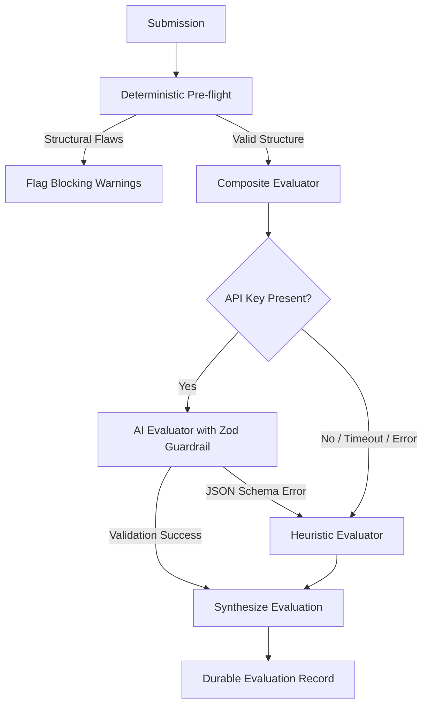

# Architect Workbench — Low-Level Design (LLD) Practice Platform

> **CipherSchools 2-Day Engineering Assignment Submission**
> 
> *An engineering-grade, rubric-based practice workbench for Low-Level Object-Oriented Design featuring evidence-backed evaluation, live telemetry, and structured semantic comparisons.*

---

## 1. What the Product Is

**Architect Workbench** is an interactive deliberate-practice platform for software engineers mastering Low-Level Design (LLD) and Object-Oriented Analysis and Design (OOAD). Instead of passive video consumption or writing hundreds of lines of boilerplate code in an isolated IDE, engineers design real-world systems (such as Parking Lots, Elevator Controllers, Vending Machines, and Notification Dispatchers) using structured architectural design sheets.

The platform provides instant, deterministic pre-flight verification, an offline-resilient composite evaluation engine, and explainable reviews with concrete evidence citations, engineering concerns, and actionable refactoring suggestions.

---

## 2. The Problem Being Solved

In modern software engineering education and interview preparation:
- **Passive Consumption Trap**: Learners watch hours of YouTube tutorials or read static GitHub repositories without ever independently making architectural decisions or facing design trade-offs.
- **Vague Feedback**: When learners attempt mock designs, feedback is typically an arbitrary score (e.g., "7/10") or high-level sentiment without citations of specific coupling issues, SOLID violations, or race conditions.
- **The Execution Mirage**: Full coding platforms (like LeetCode) judge solutions via stdout/stdin unit tests. But LLD is fundamentally about abstraction boundaries, modularity, and encapsulation—qualities that pass/fail unit tests often fail to assess.

Architect Workbench resolves this by bridging the gap between high-level architectural brainstorming and rigorous, evidence-based design review.

---

## 3. Assignment Requirements vs. Engineering Choices

To provide full transparency into our design process, we explicitly distinguish between assignment requirements and our specific architectural choices:

### What the Assignment Requires:
- **Core Loop**: Allow a learner to choose an LLD problem, understand requirements, author a design, submit it, receive evaluation feedback, review suggestions, and iterate.
- **Evaluation Mechanism**: Provide a reliable evaluation mechanism (rule-based or AI-assisted) that checks the design against specific design criteria.
- **Resilience**: Handle failures gracefully (e.g., if evaluation fails, provide clear recovery paths).
- **Working Prototype**: Deliver a functional, testable web application with complete documentation and automated test suites.

### What We Chose to Implement (Our Engineering Decisions):
- **Structured Design Sheet Model**: Rather than asking for raw, unformatted markdown or full runnable Java/C++ code, we chose a structured schema (Assumptions, Class Entities, Method Signatures, Relational Graph, Trade-offs, Edge Cases) that enables deterministic graph validation and zero-hallucination AI reviews.
- **Clean Hexagonal Architecture**: We strictly separated Domain Entities, Use Cases, and Infrastructure Adapters to keep business invariants 100% decoupled from Next.js and Prisma.
- **Composite Evaluator Architecture**: We built a tiered evaluation engine: Deterministic AST rules for pre-flight, a semantic Heuristic Engine for instant offline evaluation, and an LLM adapter with strict Zod schema validation for deep semantic reasoning.
- **Engineering Review Workbench Aesthetic**: We deliberately rejected generic LMS templates, neon cyberpunk themes, and glassmorphism in favor of a clean, high-density Technical Workbench design (`Space Grotesk`, `JetBrains Mono`, slate borders, technical telemetry badges).
- **SQLite / In-Memory Relational Persistence**: We chose SQLite via Prisma to ensure the reviewer can clone and run the entire platform with zero external dependencies (no Docker, Redis, or cloud databases required).

---

## 4. MVP Scope

The delivered MVP includes:
- **Problem Library & Briefing**: 4 fully-specified problems with functional requirements, non-functional constraints, and rubric dimensions.
- **Interactive 3-Column Practice Workspace**:
  - *Left*: Collapsible problem brief, requirements checklist, and rubric criteria.
  - *Center*: Tabbed structured design editor (Requirements, Assumptions, Classes & Methods, Relationships, Trade-offs, Edge Cases).
  - *Right*: Live telemetry inspector (structural completeness meter, relationship topology, pre-flight inspector).
- **Pre-Flight Validation Modal**: Client-side & server-side inspection catching empty fields, undeclared relationship targets, or missing edge cases before submission.
- **Durable Submission Pipeline**: State machine enforcing `DRAFT → SUBMITTED → EVALUATING → COMPLETED / FAILED`.
- **Explainable Evaluation Review**: 8 rubric dimensions featuring assessment tier, observation, direct evidence excerpt, engineering concern, actionable suggestion, and calibrated confidence score.
- **Evaluation Resilience & Retry Screen**: Handles evaluation interruptions gracefully, displaying submission timestamps and providing one-click retries.
- **Attempt History & Timeline**: Chronological revision history per problem tracking architectural improvements over time.
- **Attempt Comparison Diff**: Side-by-side semantic diff comparing classes added/modified, relationships adjusted, and rubric score changes between attempts.
- **Design System Showcase**: Complete visual catalog of all typography, color tokens, and workbench components (`/design-system`).

---

## 5. Architecture Summary

Architect Workbench is built as a modular monolith adhering to Clean Architecture principles:

```
┌─────────────────────────────────────────────────────────────┐
│                    Next.js App Router (UI)                  │
│   Dashboard  |  Library  |  Workspace  |  Review  |  Diff   │
└──────────────────────────────┬──────────────────────────────┘
                               │ HTTP / JSON API
┌──────────────────────────────▼──────────────────────────────┐
│                    Application Layer                        │
│   CreateAttemptUseCase  |  SubmitAttemptUseCase             │
│   EvaluateAttemptUseCase|  CompareAttemptsUseCase           │
└──────────────┬───────────────────────────────┬──────────────┘
               │                               │
┌──────────────▼──────────────┐ ┌──────────────▼──────────────┐
│        Domain Layer         │ │     Infrastructure Layer    │
│  • Problem Aggregate        │ │  • Prisma / SQLite Repos    │
│  • Attempt State Machine    │ │  • Composite Evaluator      │
│  • Submission Value Object  │ │    ├── Deterministic Pre-chk│
│  • Evaluation & Feedback    │ │    ├── Heuristic Engine     │
│  • Rubric Specifications    │ │    └── LLM Adapter (Zod)    │
└─────────────────────────────┘ └─────────────────────────────┘
```

### Invariants Enforced:
1. **Durable Handoff**: An attempt is *persisted with status `SUBMITTED`* before evaluation begins. Submissions cannot be lost if evaluation fails.
2. **Immutability**: Once submitted, a submission's contents are frozen. Subsequent adjustments require a new attempt.
3. **No Domain Leaks**: React components and API routes never contain business calculation logic.

---

## 6. Tech Stack

- **Runtime & Framework**: Node.js (v20+ / v22 LTS), Next.js 14 (App Router, Server & Client Components)
- **Language**: TypeScript 5 (Strict Mode enabled throughout)
- **Database & ORM**: SQLite, Prisma ORM
- **Validation**: Zod (Schema validation for API routes and LLM response contracts)
- **Styling**: Tailwind CSS + Custom Design Tokens (Workbench aesthetic)
- **Testing**: Vitest (Unit and integration test suites)
- **Icons**: Lucide React

---

## 7. Setup & Installation

### Prerequisites
- Node.js 20.x or 22.x LTS (Recommended)
- npm 9.x or higher

### Step-by-Step Setup

1. **Clone the repository**:
   ```bash
   git clone <repository-url>
   cd "Ciphers School"
   ```

2. **Install dependencies**:
   ```bash
   npm install
   ```

3. **Configure Environment Variables**:
   Create a `.env` file in the root directory (a default is provided):
   ```env
   DATABASE_URL="file:./prisma/dev.db"
   # Optional: Configure if using live AI evaluation (defaults to offline Heuristic Evaluator if omitted)
   # GEMINI_API_KEY="your-gemini-api-key"
   ```

4. **Initialize Database & Seed Data**:
   ```bash
   npx prisma db push
   npx tsx prisma/seed.ts
   ```
   *This seeds 4 problems (Parking Lot, Elevator System, Vending Machine, Notification Service) plus 2 historical attempts with evaluations for immediate demonstration.*

5. **Run the Development Server**:
   ```bash
   npm run dev
   ```
   Open [http://localhost:3000](http://localhost:3000) in your browser.

6. **Production Build & Start**:
   ```bash
   npm run build
   npm start
   ```

---

## 8. Running Automated Tests

The platform includes unit tests for domain invariants, validation rules, evaluators, and end-to-end application use case flows:

```bash
# Run all tests once
npm test

# Run tests in watch mode
npx vitest
```

---

## 9. How Evaluation Works



1. **Deterministic Pre-flight**: Traverses the submission graph in under 5ms, validating that all relationship endpoints match declared classes, method signatures are well-formed, and key sections are populated.
2. **AI Evaluator**: Uses a role-prompted Principal Architect persona to evaluate the submission against the 8 rubric dimensions, returning strictly-typed JSON validated by Zod.
3. **Heuristic Fallback Engine**: If no API key is provided, or if the external API times out, the platform falls back seamlessly to the offline `HeuristicEvaluator`. It analyzes class responsibility counts, inheritance depth, design pattern usage, and concurrency edge cases, generating evidence-based cards without external dependencies.

### Rubric Dimensions:
1. `REQ_COMPLETENESS`: Functional requirements coverage and invariant protection.
2. `CLASS_RESPONSIBILITY`: Single Responsibility Principle (SRP) and cohesive boundaries.
3. `RELATIONSHIP_CORRECTNESS`: Correct use of Association, Composition, and Inheritance.
4. `DESIGN_PATTERNS`: Appropriate design patterns (Strategy, Factory, State, Observer) without over-engineering.
5. `EXTENSIBILITY`: Open-Closed Principle (OCP) and future enhancement adaptability.
6. `EDGE_CASES`: Concurrency, resource exhaustion, and failure condition handling.
7. `DATA_STRUCTURES`: Internal collections, state tracking efficiency, and lookup performance.
8. `DESIGN_DECISIONS`: Explicit trade-off articulation and justification for rejected alternatives.

---

## 10. Recruiter Demo Walkthrough (5-Minute Tour)

For evaluators reviewing this submission, follow these steps to see the entire loop:

1. **Dashboard (`/`)**:
   - Observe the quick stats, active problem banner, and recent attempts.
   - Click **"Browse Library"** or select **"Parking Lot System"**.
2. **Problem Detail (`/problems/prob-parking-lot`)**:
   - Inspect the structured brief: Requirements, Scope, Constraints, and Rubric Criteria.
   - Click **"Start Practice Session"** to launch a new attempt.
3. **Practice Workspace (`/practice/<attemptId>`)**:
   - Notice the 3 columns: Problem Brief on the left, Design Sheet in the center, Live Telemetry on the right.
   - Use the **"Classes & Responsibilities"** tab to add a class using the modal editor.
   - Observe the **Live Telemetry** updating class counts and completeness metrics.
   - Click **"Pre-Flight Check"** in the top bar to inspect validation signals.
   - Click **"Submit Design"** in the pre-flight modal.
4. **Evaluation Review (`/attempts/<attemptId>/evaluation`)**:
   - Review the synthesized verdict, strengths, and priority improvements.
   - Expand rubric cards to inspect the **Evidence Citations**, **Engineering Concerns**, and **Actionable Suggestions**.
5. **Attempt History (`/problems/prob-parking-lot/history`)**:
   - View the seeded progression between Attempt 1 and Attempt 2.
   - Click **"Compare Attempts"** or select two attempts to diff.
6. **Attempt Diff (`/attempts/compare?attempt1=att-parking-lot-01&attempt2=att-parking-lot-02`)**:
   - Inspect side-by-side structural diffs: Classes added/removed, relationships changed, and rubric assessment shifts.
7. **Design System Showcase (`/design-system`)**:
   - View the complete implementation of typography, colors, status badges, confidence meters, and workbench UI components.

---

## 11. Known Limitations

- **Concurrent Real-Time Multi-User Collaboration**: The current platform is optimized for individual practice and asynchronous review; simultaneous real-time multi-cursor editing is not implemented.
- **Code Sandbox Execution**: The platform focuses on object-oriented architecture and design sheet specification rather than running compiled bytecode.
- **Custom Problem Creator UI**: Problems are managed via database seeds and API endpoints; an administrative WYSIWYG problem creation UI was left for future iterations.

---

## 12. Future Extensions

1. **Automated Code Scaffolding**: Compile the structured design sheet into starter Java/TypeScript class files with interface stubs and docstrings.
2. **Interactive Class Diagram Canvas**: Bi-directional visual class diagram editor where editing nodes updates the design sheet and vice-versa.
3. **Peer Review Mode**: Allow mentors or study groups to annotate specific design sheet sections alongside AI evaluations.
4. **Company-Specific Track Packs**: Filter problem sets and rubrics by company archetypes (e.g., FAANG LLD interview style vs. Startup rapid prototyping style).
